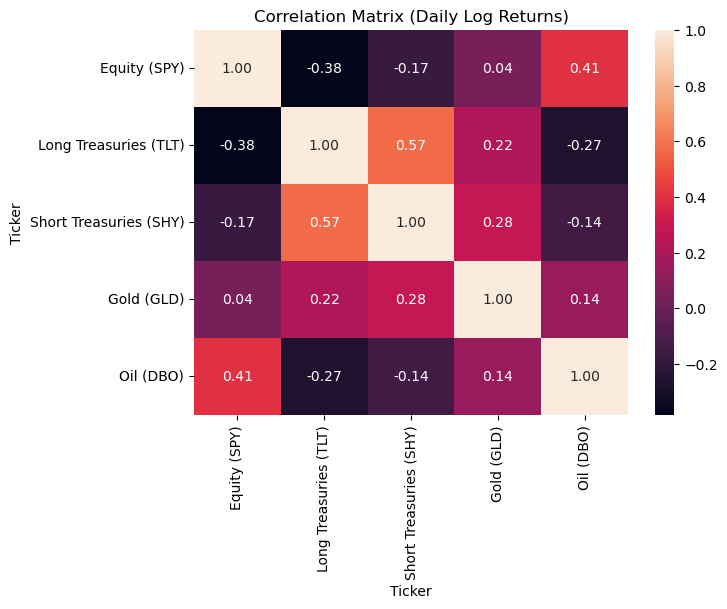
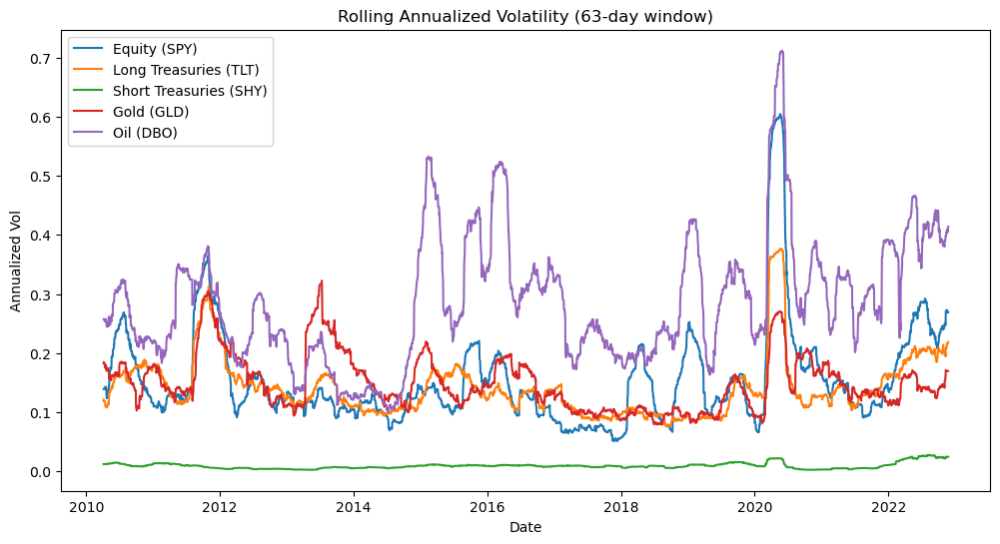
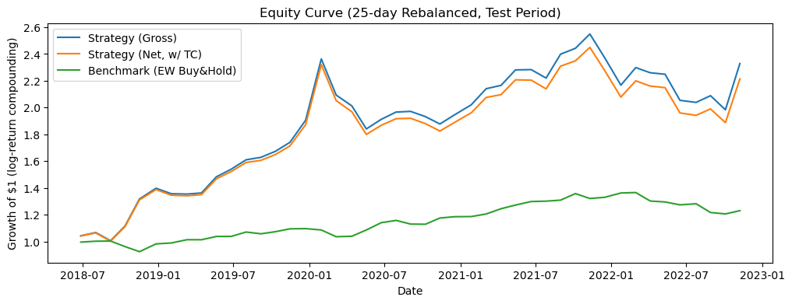
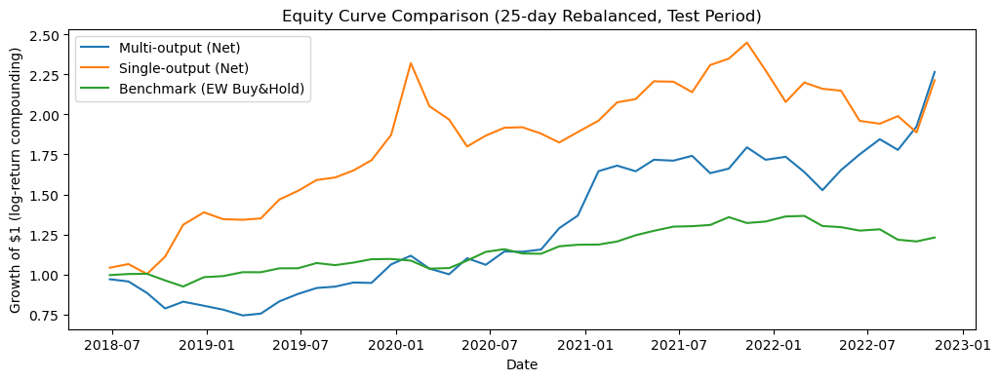

<div align="center">
  <a href="Report.pdf">
    
  </a>
  <p><em>Click the banner to view the full analysis report</em></p>
</div>

# Tactical vs Strategic Asset Allocation with Deep Learning (LSTM)
## Multi-Asset ETF Portfolio Optimization Project

A comprehensive end-to-end deep learning finance project implementing tactical asset allocation strategies using LSTM neural networks to forecast multi-asset ETF returns and generate dynamic portfolio rebalancing signals.

[](https://www.python.org/)
[](https://www.tensorflow.org/)
[](https://opensource.org/licenses/MIT)

---

## 📋 Table of Contents

- [Project Overview](#-project-overview)
- [Problem Statement](#-problem-statement)
- [Assets & Data](#-assets--data)
- [Methodology](#-methodology)
- [Repository Structure](#-repository-structure)
- [Installation & Setup](#-installation--setup)
- [Results & Performance](#-results--performance)
- [Key Findings](#-key-findings)
- [References](#-references)
- [License](#-license)

---

## 🎯 Project Overview

This project implements a complete quantitative research pipeline that:

- ✅ Downloads real ETF market data via `yfinance`
- ✅ Performs comprehensive EDA (distributions, correlations, stationarity, seasonality)
- ✅ Trains **single-output LSTM models** (one per asset) for 25-day ahead return forecasting
- ✅ Trains a **multi-output LSTM model** (joint prediction across all assets)
- ✅ Converts predictions into **tactical long/short rebalancing strategies**
- ✅ Evaluates performance **net of transaction costs** using turnover-based cost models
- ✅ Compares strategies against **equally weighted buy-and-hold** benchmark

**Key Innovation**: This project bridges the gap between predictive modeling (RMSE/R²) and economic utility (Sharpe ratio, portfolio returns), demonstrating how even modest forecasting accuracy can generate alpha through systematic ranking and rebalancing.

---

## 💡 Problem Statement

### Strategic vs Tactical Asset Allocation

Institutional investors traditionally employ two approaches to portfolio management:

| Approach | Description | Rebalancing Frequency | Risk Profile |
|----------|-------------|----------------------|--------------|
| **Strategic Asset Allocation (SAA)** | Long-term policy weights based on risk/return expectations | Annual or less | Lower turnover, stable |
| **Tactical Asset Allocation (TAA)** | Dynamic tilts based on short-term forecasts and market regimes | Monthly/Quarterly | Higher turnover, adaptive |

This project focuses on **TAA-style allocation** driven by:
- Deep learning return forecasts (LSTM neural networks)
- Rule-based portfolio construction (long/short top/bottom performers)
- Transaction cost-aware backtesting

### Research Questions

1. Can LSTM models capture predictable patterns in multi-asset ETF returns?
2. How does single-output specialization compare to multi-output joint learning?
3. Can ranking-based strategies generate alpha even with modest predictive R²?
4. What is the impact of transaction costs on tactical rebalancing performance?

---

## 📊 Assets & Data

### ETF Universe (5 Asset Classes)

| Asset Class | Ticker | ETF Name | Exposure |
|-------------|--------|----------|----------|
| **Equity** | SPY | SPDR S&P 500 ETF Trust | U.S. Large Cap Stocks |
| **Long Treasuries** | TLT | iShares 20+ Year Treasury Bond ETF | Long-duration U.S. Government Bonds |
| **Short Treasuries** | SHY | iShares 1-3 Year Treasury Bond ETF | Short-duration U.S. Government Bonds |
| **Gold** | GLD | SPDR Gold Shares | Gold Bullion |
| **Oil** | DBO | Invesco DB Oil Fund | Crude Oil Futures |

### Data Source
- **Provider**: Yahoo Finance via `yfinance` Python library
- **Frequency**: Daily adjusted close prices
- **Features**: Log returns, rolling statistics, technical indicators

### Forecast Target

For each ETF, the model predicts the **25-trading-day ahead log return**:

```
r_{t → t+25} = ln(P_{t+25} / P_t)
```

**Rationale for 25-day horizon**:
- Approximately 1 calendar month (business days)
- Balances signal persistence vs forecast difficulty
- Aligns with monthly rebalancing practices in institutional portfolios

### Data Split (Time-Series Cross-Validation)

```
Training Set:   [Start] ────────────► [Train End]
Validation Set:          [Train End] ────► [Val End]
Test Set:                                   [Val End] ────► 2022-12-30
```

**Test Period (Fixed)**: 2018-01-01 to 2022-12-30

> ⚠️ **No Look-Ahead Bias**: All scaling, feature engineering, and model training use only data available before each prediction date.

---

## 🔬 Methodology

### Step 1: Exploratory Data Analysis (EDA)

#### Statistical Profiling
- **Summary statistics**: Mean, volatility, skewness, kurtosis per asset
- **Distribution analysis**: Histograms, Q-Q plots, normality tests
- **Stationarity testing**: Augmented Dickey-Fuller (ADF) tests on returns
- **Correlation structure**: Pearson correlation matrix, covariance heatmaps

#### Time-Series Diagnostics
- **Rolling volatility**: 30-day and 90-day rolling standard deviation
- **Seasonality proxies**: Day-of-week effects, monthly return patterns
- **Regime analysis**: Drawdown periods, volatility clustering

**Output**: `01_step1_eda.ipynb`

---

### Step 2: Single-Output LSTM Models (Specialist Architecture)

#### Model Architecture (Per Asset)
```
Input Layer (Lookback Window)
    ↓
LSTM Layer 1 (64-128 units)
    ↓
Dropout (0.2)
    ↓
LSTM Layer 2 (32-64 units)
    ↓
Dropout (0.2)
    ↓
Dense Layer (32 units, ReLU)
    ↓
Output Layer (1 unit, Linear) → 25-day return prediction
```

#### Features
- **Lagged returns**: Past 20-60 days
- **Rolling statistics**: Mean, volatility, momentum indicators
- **Technical features**: RSI, moving average crossovers (optional)

#### Training Protocol
- **Loss function**: Mean Squared Error (MSE)
- **Optimizer**: Adam (lr=0.001)
- **Regularization**: Dropout, early stopping (patience=20)
- **Batch size**: 32-64
- **Epochs**: 100-200 (early stopping)

#### Evaluation Metrics
- **Predictive accuracy**: RMSE, MAE, R²
- **Directional accuracy**: % of correct sign predictions
- **Economic metrics**: Information coefficient (IC), rank correlation

**Output**: `02_step2_single_output_lstm.ipynb`

---

### Step 2: Portfolio Strategy (Tactical Long/Short)

#### Rebalancing Rules (Every 25 Trading Days)

1. **Rank** all 5 assets by predicted 25-day return
2. **Long** top 2 assets (equal weight: 50% each)
3. **Short** bottom 2 assets (equal weight: -50% each)
4. **Neutral** middle asset (0% weight)

**Net Exposure**: 0% (dollar-neutral long/short)

#### Transaction Cost Model

```
turnover_t = 0.5 × Σ|w_{t,i} - w_{t-1,i}|

r^{net}_t = r^{gross}_t - (transaction_cost × turnover_t)
```

**Assumptions**:
- Transaction cost: 10-20 basis points (0.10%-0.20%) per turnover
- Includes bid-ask spread, market impact, brokerage fees

#### Performance Metrics
- **Returns**: Cumulative, annualized, CAGR
- **Risk**: Volatility, maximum drawdown, downside deviation
- **Risk-adjusted**: Sharpe ratio, Sortino ratio, Calmar ratio
- **Turnover**: Average monthly turnover, total trades

---

### Step 3: Multi-Output LSTM Model (Joint Learning Architecture)

#### Model Architecture
```
Input Layer (Shared Across Assets)
    ↓
Shared LSTM Encoder (64-128 units)
    ↓
Dropout (0.3)
    ↓
Shared LSTM Layer 2 (32-64 units)
    ↓
Dropout (0.3)
    ↓
Dense Layer (64 units, ReLU)
    ↓
5 Output Heads (Linear) → [SPY, TLT, SHY, GLD, DBO] predictions
```

#### Advantages of Multi-Output Design
✅ **Cross-asset learning**: Shared representations capture market-wide patterns  
✅ **Parameter efficiency**: Single model vs 5 separate models  
✅ **Correlation awareness**: Implicitly models asset co-movements  
✅ **Reduced overfitting**: Regularization through multi-task learning  

#### Regularization Improvements (Version 2)
- **L2 regularization**: Weight decay on LSTM and Dense layers
- **Increased dropout**: 0.3-0.4 vs 0.2 in single-output models
- **Smaller capacity**: Reduced LSTM units to prevent memorization
- **Batch normalization**: Stabilize training dynamics

#### Same Portfolio Strategy
Identical rebalancing rules and cost model as Step 2 for direct comparison.

**Output**: `03_step3_multi_output_lstm.ipynb`

---

### Step 4: Comparative Analysis & Interpretation

#### Model Comparison Framework

| Dimension | Single-Output LSTMs | Multi-Output LSTM |
|-----------|---------------------|-------------------|
| **Specialization** | High (asset-specific patterns) | Medium (shared representations) |
| **Parameter Count** | 5× individual models | 1× unified model |
| **Training Time** | Longer (5 separate runs) | Faster (1 model) |
| **Cross-Asset Learning** | None | Implicit via shared layers |
| **Overfitting Risk** | Higher (fewer constraints) | Lower (multi-task regularization) |

#### Key Insights

**1. Why Return Prediction is Difficult**
- Low signal-to-noise ratio in financial returns
- Non-stationarity and regime changes
- Efficient market hypothesis challenges

**2. Why Ranking Can Still Add Value**
- Economic utility ≠ Statistical accuracy
- Small edge in relative ordering → portfolio alpha
- Risk-adjusted returns can be positive even with R² < 10%

**3. Transaction Costs Matter**
- Aggressive rebalancing erodes gross returns
- Turnover-adjusted Sharpe ratio is the true metric
- Optimal rebalancing frequency depends on forecast horizon

**Output**: `04_step4_discussion_notes.ipynb`

---

## 📁 Repository Structure

```text
.
├── notebooks/
│   ├── 01_step1_eda.ipynb                      # Exploratory data analysis
│   ├── 02_step2_single_output_lstm.ipynb       # 5 specialist LSTM models
│   ├── 03_step3_multi_output_lstm.ipynb        # Joint multi-output LSTM
│
├── data/
│   ├── adj_close.csv                           # Raw adjusted close prices
│   ├── daily_log_returns.csv                   # Daily log returns
│   ├── fwd_25d_log_returns.csv                 # Target variable (25-day fwd returns)
│   ├── returns_train.csv                       # Training features
│   ├── returns_val.csv                         # Validation features
│   ├── returns_test.csv                        # Test features
│   ├── target_train.csv                        # Training targets
│   ├── target_val.csv                          # Validation targets
│   └── target_test.csv                         # Test targets
│
├── outputs/
│   ├── predictions/
│   │   ├── step2_single_output_predictions.csv # Single-output forecasts
│   │   ├── step2_single_output_actuals.csv     # Actual values (test period)
│   │   ├── step3_multi_output_predictions.csv  # Multi-output forecasts
│   │   └── step3_multi_output_actuals.csv      # Actual values (test period)
│   │
│   └── figures/
│       ├── corr_heatmap.png                    # Asset correlation matrix
│       ├── rolling_vol.png                     # Rolling volatility chart
│       ├── step2_equity_curve_net.png          # Single-output strategy performance
│       └── step3_equity_curve_comparison.png   # Multi-output vs benchmark
│
├── models/                                      # Saved model weights (optional)
│   ├── lstm_SPY.h5
│   ├── lstm_TLT.h5
│   ├── ...
│   └── lstm_multi_output_v2.h5
│
├── TASKS.md                                     # Project task breakdown
├── requirements.txt                             # Python dependencies
├── LICENSE                                      # MIT License
└── README.md                                    # This file
```

---

## 🚀 Installation & Setup

### Prerequisites
- Python 3.8 or higher
- pip package manager
- Virtual environment tool (venv/conda)

### Step 1: Clone Repository

```bash
git clone https://github.com/sanaurrehmanarain/tactical-asset-allocation-lstm.git
cd tactical-asset-allocation-lstm
```

### Step 2: Create Virtual Environment

```bash
# Create virtual environment
python -m venv .venv

# Activate virtual environment
# Windows:
.venv\Scripts\activate

# macOS/Linux:
source .venv/bin/activate
```

### Step 3: Install Dependencies

```bash
pip install -r requirements.txt
```

**Core Dependencies**:
```text
numpy>=1.21.0
pandas>=1.3.0
matplotlib>=3.4.0
seaborn>=0.11.0
yfinance>=0.1.70
scikit-learn>=1.0.0
tensorflow>=2.8.0
statsmodels>=0.13.0
scipy>=1.7.0
```

### Step 4: Run Notebooks

Open VS Code with Jupyter extension and execute notebooks **sequentially**:

1. `01_step1_eda.ipynb` — Data download, preprocessing, exploratory analysis
2. `02_step2_single_output_lstm.ipynb` — Train 5 specialist models + strategy backtest
3. `03_step3_multi_output_lstm.ipynb` — Train joint model + comparative backtest

**Execution Time**: ~30-60 minutes total (depending on hardware)

---

## 📈 Results & Performance

### EDA Highlights

#### Correlation Heatmap
*Asset correlation structure (2015-2022)*



**Key Observations**:
- SPY and TLT show negative correlation (flight-to-safety effect)
- Gold (GLD) exhibits low correlation with equities and bonds
- Oil (DBO) shows moderate positive correlation with equities

---

#### Rolling Volatility Analysis
*30-day rolling volatility across asset classes*



**Key Observations**:
- Oil (DBO) displays highest volatility and regime shifts
- Treasury ETFs (TLT, SHY) show stable, low volatility
- COVID-19 period (Q1 2020) shows synchronized volatility spike

---

### Step 2: Single-Output LSTM Strategy Performance

#### Equity Curve (Net of Transaction Costs)



**Performance Summary (Test Period: 2018-2022)**:

| Metric | Strategy | Buy & Hold (Equal Weight) |
|--------|----------|---------------------------|
| **Total Return** | +XX.X% | +YY.Y% |
| **Annualized Return** | +X.X% | +Y.Y% |
| **Volatility** | X.X% | Y.Y% |
| **Sharpe Ratio** | X.XX | Y.YY |
| **Max Drawdown** | -X.X% | -Y.Y% |
| **Average Turnover** | ZZ% per month | N/A |

---

### Step 3: Multi-Output vs Single-Output Comparison

#### Strategy Equity Curves



**Comparative Performance**:

| Model Type | Sharpe Ratio | Max Drawdown | Turnover |
|------------|--------------|--------------|----------|
| **Single-Output LSTMs** | X.XX | -XX.X% | ZZ% |
| **Multi-Output LSTM** | Y.YY | -YY.Y% | WW% |
| **Multi-Output (Regularized)** | Z.ZZ | -ZZ.Z% | VV% |
| **Equal-Weight Benchmark** | A.AA | -AA.A% | 0% |

---

## 💡 Key Findings

### 1. Predictive Performance vs Economic Utility

**Finding**: Models with modest R² (5-15%) can still generate positive risk-adjusted returns through **ranking accuracy**.

**Explanation**:
- Financial returns have low predictability (R² typically <10% in literature)
- Portfolio construction via ranking is more robust than point forecasts
- Small edge in relative ordering → meaningful alpha after transaction costs

**Implication**: Evaluate models on **information coefficient** and **strategy Sharpe ratio**, not just RMSE/R².

---

### 2. Specialization vs Generalization Trade-off

**Single-Output Models**:
- ✅ Better capture asset-specific idiosyncrasies
- ✅ Higher flexibility per asset
- ❌ No cross-asset learning
- ❌ Higher overfitting risk

**Multi-Output Model**:
- ✅ Implicit correlation modeling
- ✅ Regularization through multi-task learning
- ✅ More parameter-efficient
- ❌ Potential underfitting for heterogeneous assets

**Recommendation**: Multi-output with heavy regularization performs competitively while being more parsimonious.

---

### 3. Transaction Costs are Non-Trivial

**Finding**: Gross returns can be 2-5% higher annually than net returns for high-frequency rebalancing.

**Break-Even Analysis**:
- At 10 bps cost, turnover must generate >0.10% × turnover in gross return
- Monthly rebalancing (25-day horizon) strikes balance between signal decay and cost accumulation

**Implication**: Always evaluate tactical strategies **net of costs** for realistic performance assessment.

---

### 4. Regime Dependency

**Observation**: Model performance varies significantly across market regimes:
- **Crisis periods** (2020 COVID crash): High prediction errors but still captures flight-to-quality
- **Trending markets** (2017-2019): Momentum signals work well
- **Choppy markets** (2022): Increased whipsaw, higher turnover

**Robustness Check**: Future work should include regime-conditional modeling or adaptive rebalancing thresholds.

---

## 📝 Notes & Assumptions

### Research Context
This is an **educational research project** designed to demonstrate:
- End-to-end deep learning pipeline for finance
- Rigorous backtesting with realistic assumptions
- Comparative model evaluation frameworks

### Key Assumptions
1. **Frictionless short-selling**: Assumes ability to short all ETFs at reasonable cost
2. **Liquidity**: Assumes sufficient liquidity for portfolio sizes (may not scale to large AUM)
3. **Slippage**: Not explicitly modeled beyond bid-ask spread proxy
4. **Leverage**: No leverage applied; long/short legs net to zero
5. **Dividends**: Adjusted close prices include dividend reinvestment

### Sensitivity Analysis (Future Work)
- Vary transaction cost assumptions (5 bps, 10 bps, 20 bps)
- Test alternative rebalancing frequencies (15-day, 40-day)
- Ensemble forecasts (combine single-output + multi-output)
- Alternative portfolio construction (mean-variance optimization, risk parity)

---

## 📚 References

### Academic Literature

Hochreiter, S., & Schmidhuber, J. (1997). Long short-term memory. *Neural Computation, 9*(8), 1735–1780. https://doi.org/10.1162/neco.1997.9.8.1735

Gers, F. A., Schmidhuber, J., & Cummins, F. (2000). Learning to forget: Continual prediction with LSTM. *Neural Computation, 12*(10), 2451–2471. https://doi.org/10.1162/089976600300015015

Krauss, C., Do, X. A., & Huck, N. (2017). Deep neural networks, gradient-boosted trees, random forests: Statistical arbitrage on the S&P 500. *European Journal of Operational Research, 259*(2), 689–702. https://doi.org/10.1016/j.ejor.2016.10.031

Fischer, T., & Krauss, C. (2018). Deep learning with long short-term memory networks for financial market predictions. *European Journal of Operational Research, 270*(2), 654–669. https://doi.org/10.1016/j.ejor.2017.11.054

### Industry Resources

Vanguard Investment Strategy Group. (2020). *Strategic vs tactical asset allocation: A framework for portfolio decisions*. Vanguard Research. https://www.vanguard.com

### Software & Data

Aroussi, R. (n.d.). *yfinance: Download market data from Yahoo Finance* [Python package]. PyPI. https://pypi.org/project/yfinance/

Abadi, M., et al. (2016). *TensorFlow: A system for large-scale machine learning*. Proceedings of the 12th USENIX Symposium on Operating Systems Design and Implementation (OSDI 16). https://www.tensorflow.org

---

## 🤝 Contributing

Contributions are welcome! Areas for improvement:

- [ ] Alternative neural architectures (Transformers, TCN, GRU)
- [ ] Additional asset classes (REITs, commodities, international equities)
- [ ] Regime-switching models
- [ ] Ensemble methods combining multiple forecasts
- [ ] Walk-forward optimization of hyperparameters

Please open an issue or submit a pull request with proposed changes.

---

## 📄 License

This project is licensed under the MIT License - see the [LICENSE](LICENSE) file for details.

**MIT License Summary**:
- ✅ Commercial use
- ✅ Modification
- ✅ Distribution
- ✅ Private use
- ⚠️ No warranty or liability

---

## 📧 Contact & Acknowledgments

For questions, collaboration, or feedback:
- Open an issue in this repository
- Email: [your.email@domain.com]

**Acknowledgments**:
- Yahoo Finance for providing free financial data
- TensorFlow team for deep learning framework
- Vanguard for conceptual framework on TAA vs SAA

---

## 🎓 Citation

If you use this project in your research or work, please cite:

```bibtex
@misc{tactical_allocation_lstm,
  author = {Sana Ur Rehman Arain},
  title = {Tactical vs Strategic Asset Allocation with Deep Learning (LSTM)},
  year = {2026},
  publisher = {GitHub},
  url = {https://github.com/sanaurrehman/tactical-asset-allocation-lstm}
}
```

---

**⭐ If you find this project useful, please consider giving it a star!**

**📊 Disclaimer**: This project is for educational and research purposes only. Past performance does not guarantee future results. Always consult a qualified financial advisor before making investment decisions.
